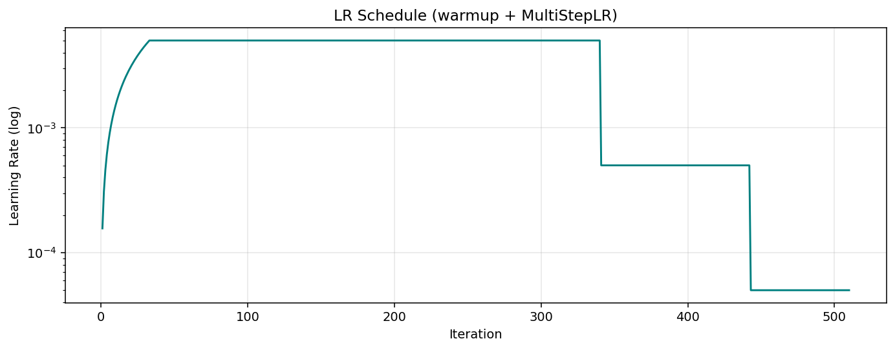
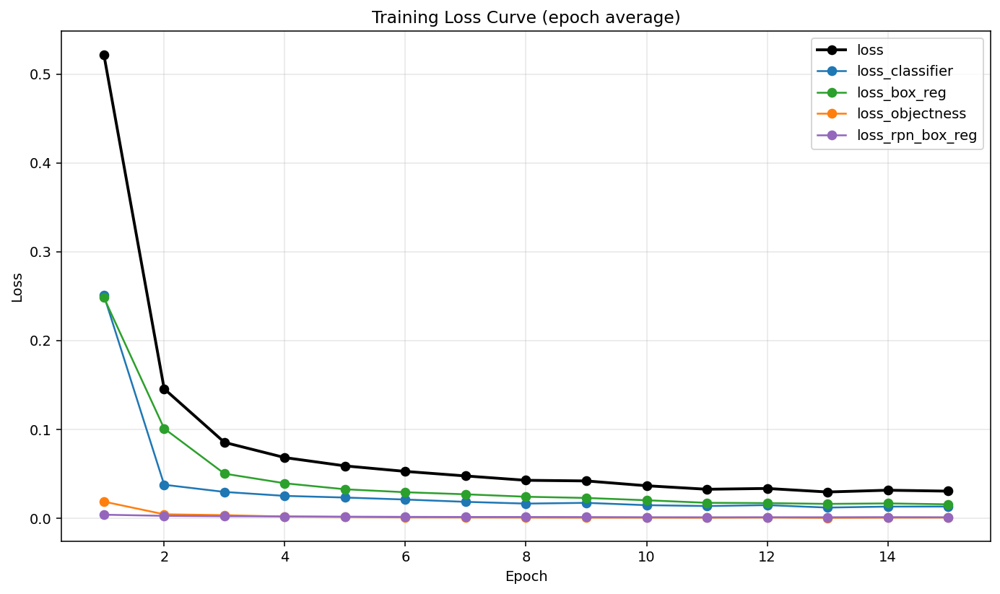
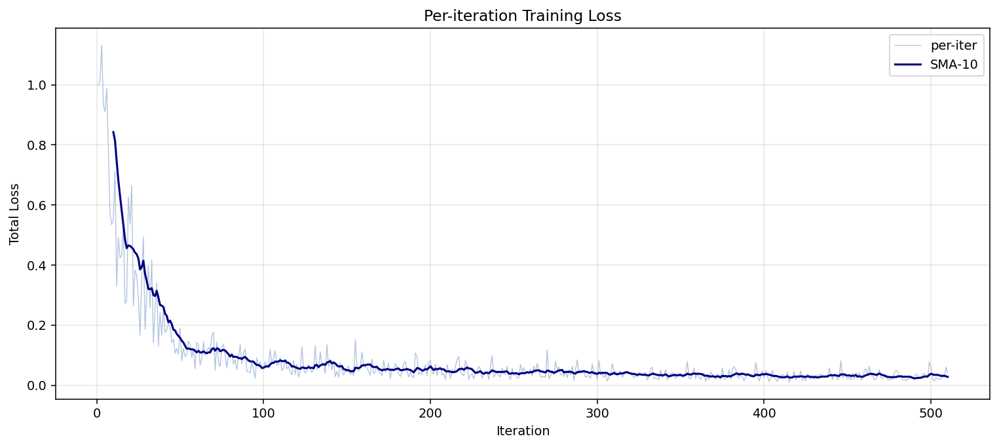
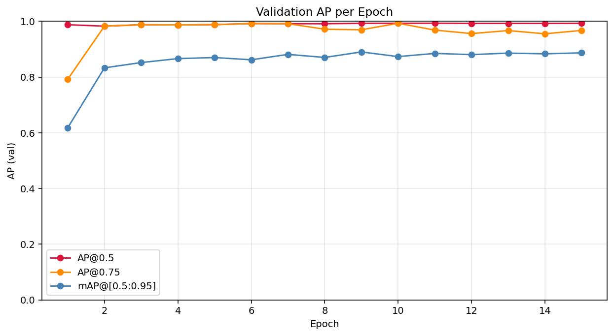
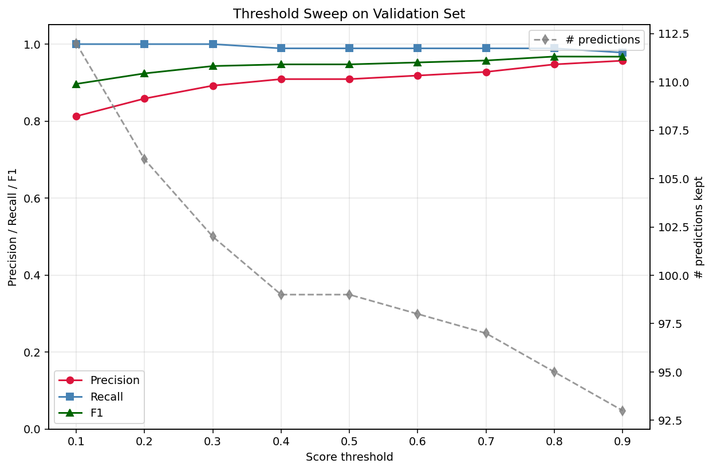
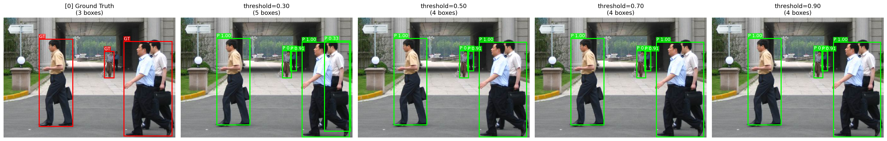
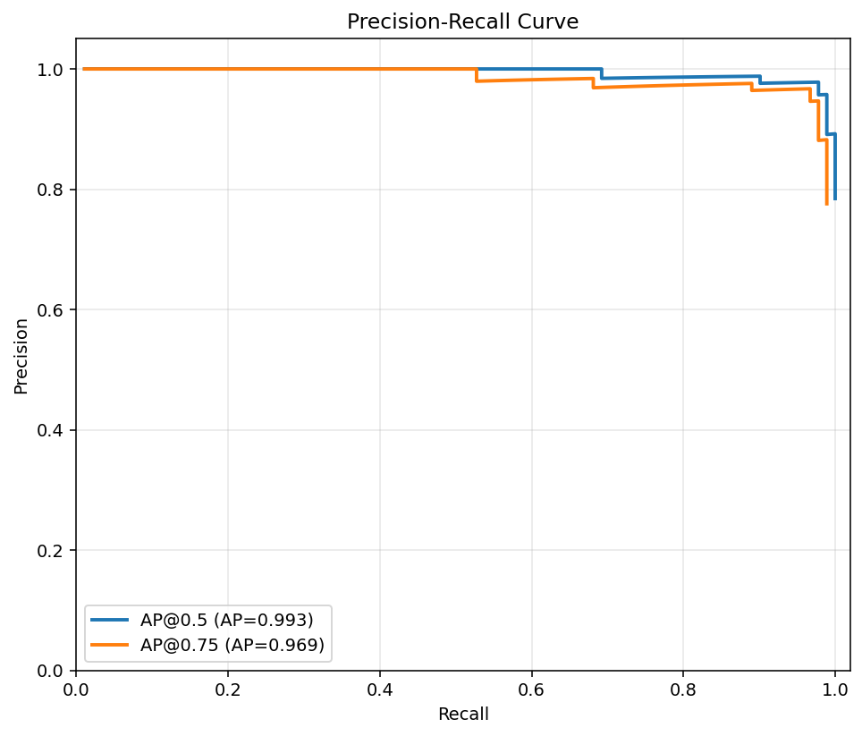
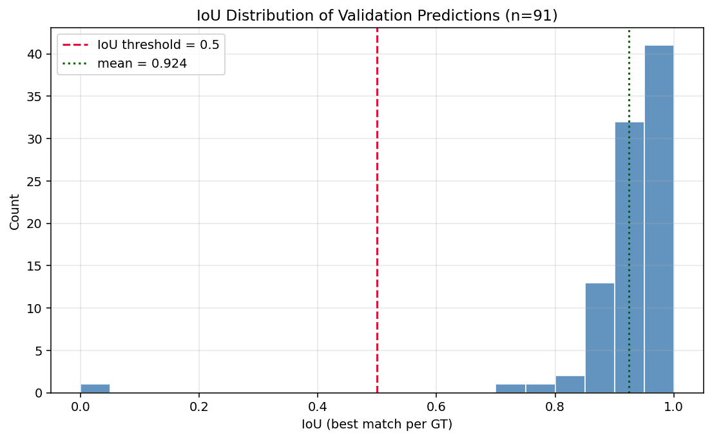

# 实验三: 基于 Faster R-CNN 的 Penn-Fudan 行人检测

> 姓名: gxr
> 日期: 2026-04-19
> 环境: conda env `ml`, PyTorch 2.5.1 + CUDA 12.1, RTX 4090
> 运行时间: ~2.1 分钟 (15 epochs, GPU)

---

## 0. 结果速览

| 指标                                  | 数值       |
| ------------------------------------ | ---------- |
| **AP@0.5**                           | **0.9934** |
| AP@0.75                              | 0.9687     |
| **mAP@[0.5:0.95]** (COCO 主指标)      | **0.8850** |
| 预测 IoU 均值 (score ≥ 0.5)           | 0.924      |
| 预测 IoU 中位数                       | 0.948      |
| 最佳 F1                              | **0.968** (score threshold=0.80) |
| 训练集 / 验证集                       | 136 / 34   |
| 总训练耗时                            | ~2.1 min   |

- 曲线与可视化全部位于 [outputs/figures/](outputs/figures/) 与 [outputs/predictions/](outputs/predictions/).
- 原始日志在 [outputs/logs/train.log](outputs/logs/train.log), 推理日志在 [outputs/logs/inference_stdout.log](outputs/logs/inference_stdout.log).
- 指标 JSON: [outputs/metrics.json](outputs/metrics.json), [outputs/inference_report.json](outputs/inference_report.json).

---

## 一、数据层: 从掩码到 (boxes, labels)

### 1.1 Penn-Fudan 掩码编码

官方 [readme.txt](../PennFudanPed/readme.txt) 告诉我们:

- `PNGImages/FudanPedXXXXX.png`: 彩色原图.
- `PedMasks/FudanPedXXXXX_mask.png`: 实例分割掩码, 像素值编码为:
  - `0` = 背景;
  - `i (i ≥ 1)` = 第 i 个行人实例的前景像素.

### 1.2 从掩码提取 bbox

检测任务只需要 `[x_min, y_min, x_max, y_max]`, 所以对每个实例 ID 取其掩码像素坐标的极值即可:

```python
obj_ids = np.unique(mask)
obj_ids = obj_ids[obj_ids != 0]
for oid in obj_ids:
    ys, xs = np.where(mask == oid)
    x_min, x_max = xs.min(), xs.max()
    y_min, y_max = ys.min(), ys.max()
```

完整实现见 [src/dataset.py](src/dataset.py#L53).

### 1.3 `__getitem__` 返回的 target 字典

torchvision Faster R-CNN 约定 target 含:

| 键         | 类型 / 形状           | 含义                              |
| --------- | -------------------- | -------------------------------- |
| `boxes`   | FloatTensor [N, 4]   | 绝对坐标 (x1,y1,x2,y2)             |
| `labels`  | Int64Tensor [N]      | 类别 id (1=行人, 0 保留给背景)       |
| `image_id`| Int64Tensor [1]      | 图像序号 (评估/调试用)              |
| `area`    | FloatTensor [N]      | bbox 面积                         |
| `iscrowd` | Int64Tensor [N]      | 本数据集全 0                       |

### 1.4 数据增广

除了 `ToTensor` 之外, 训练集还叠加了:

- **RandomHorizontalFlip**: 水平翻转同步翻转 `boxes` 的 x 坐标 (注意: `x1', x2' = W-x2, W-x1`).
- **ColorJitter**: 亮度/对比度/饱和度轻微抖动, 只作用在像素, 不改 boxes.
- **RandomGaussianNoise**: 小方差噪声, 提高鲁棒性.

几何变换必须同步到 boxes 才是正确的. 颜色/噪声类变换不影响 boxes. 实现见 [src/transforms.py](src/transforms.py).

### 1.5 GT 标注样例图 (作业要求: 生成四张数据集中的带 box 标注原图)

| 文件                                              | 说明                  |
| ------------------------------------------------- | -------------------- |
| [outputs/figures/gt_samples.png](outputs/figures/gt_samples.png) | 训练集 4 张带红色 GT 框 |
| [outputs/figures/gt_val_0.png](outputs/figures/gt_val_0.png)     | 验证集样例 1         |
| [outputs/figures/gt_val_1.png](outputs/figures/gt_val_1.png)     | 验证集样例 2         |

---

## 二、模型层: 迁移学习 (COCO → 2 类)

### 2.1 为什么迁移学习

- **类别数量不匹配**: COCO 模型输出 81 维 (80 类 + 背景), 直接用会报错或预测错误类别.
- **数据效率**: Penn-Fudan 只有 170 张图, 从零训练学不到基础的边缘/纹理特征.
- **收敛速度**: COCO 预训练已包含行人相关的底层特征, 微调几十个 iter 就能看到显著效果 (本次训练第 1 个 epoch 就 AP@0.5 = 0.988).

### 2.2 三步改造

```python
num_classes = 2                                              # 1) 目标类别数 (含背景)
in_features = model.roi_heads.box_predictor.cls_score.in_features  # 2) 原头输入通道
model.roi_heads.box_predictor = FastRCNNPredictor(in_features, num_classes)  # 3) 换头
```

除了 `box_predictor`, 其他层的 COCO 权重都保留下来.

代码实现: [src/model.py](src/model.py).

### 2.3 模型选择: v2 版本

torchvision 提供:

- `fasterrcnn_resnet50_fpn` (v1) : COCO mAP ~37.0.
- `fasterrcnn_resnet50_fpn_v2` (v2): 加强版 anchors + head, COCO mAP ~46.7.

本实验默认使用 **v2** (`config.MODEL_VARIANT = "v2"`), 因为在相同训练成本下 v2 收敛更高, Penn-Fudan 这种小数据集也能沾光.

参数规模:

| 模块         | 数量          |
| ----------- | ------------- |
| 总参数       | 43.26 M       |
| 可训练参数   | 43.03 M       |
| 冻结参数     | 0.22 M (BN 等) |

---

## 三、训练层: Loss 观察与 LR 调度

### 3.1 优化器与学习率

- **优化器**: SGD, lr=0.005, momentum=0.9, weight_decay=5e-4.
- **Warmup**: 第一个 epoch 使用线性 warmup (warmup_factor=1/1000, 最多 500 iter 或当 epoch iter 数-1). 这一步非常重要: 不做 warmup 时, 初始大 LR 会破坏预训练权重, 甚至出现 NaN loss.
- **主调度**: MultiStepLR, 在 epoch=10, 13 处将 LR 乘 0.1. 这样前期快速下降, 后期精细微调.
- **梯度裁剪**: `torch.nn.utils.clip_grad_norm_(params, 5.0)` 防止偶发 NaN.

LR 实际轨迹:



可以看到: warmup (前 33 iter, lr 从 ~5e-6 线性上升到 5e-3) → 稳定 → 在第 10 epoch 降到 5e-4 → 第 13 epoch 降到 5e-5.

### 3.2 四大 Loss 的含义

Faster R-CNN 返回的 `loss_dict` 有 4 项 (+ 总和):

| Loss               | 来源                     | 含义                              |
| ------------------ | ------------------------ | -------------------------------- |
| `loss_objectness`  | RPN 分类头               | 区分前景 vs 背景 (二分类)           |
| `loss_rpn_box_reg` | RPN 回归头               | 粗略定位 (anchor 微调)            |
| `loss_classifier`  | R-CNN 分类头             | 精确分类 (行人 vs 背景)            |
| `loss_box_reg`     | R-CNN 回归头             | 精确定位 (RoI 再回归)             |

### 3.3 Loss 曲线

**Per-epoch 平均 loss**:



观察:

- `loss` 从 0.52 (epoch 0) → 0.03 (epoch 14), 下降 17 倍.
- `loss_box_reg` 与 `loss_classifier` 是主导项.
- `loss_rpn_box_reg` / `loss_objectness` 很快降至接近 0, 因为 RPN 用 COCO 预训练后对"有没有物体"基本掌握了.

**Per-iter loss**:



每 iter 的 loss 与 10-iter 滑动平均. 可以清晰看到 warmup 阶段从 ~1.0 快速下降到 0.2 左右.

### 3.4 mAP 曲线 (验证集)



- AP@0.5 在第 1 epoch 就达到 0.988, 3 epoch 后稳定在 0.99+.
- AP@0.75 需要更多 epochs, 但最终也到 0.97.
- mAP@[0.5:0.95] 从 epoch 0 的 0.618 稳步上升到 0.885.

> 实验观察: **即使只跑 10 个 iter, loss 也能看到明显下降**, 这正是迁移学习的威力.

---

## 四、评价层: 阈值与 IoU 分析

### 4.1 推理阈值扫描

对验证集全量推理后, 遍历置信度阈值 ∈ {0.1, 0.2, ..., 0.9}, 在 IoU=0.5 下统计 P/R/F1:



| threshold | precision | recall | F1    | # pred |
| --------- | --------- | ------ | ----- | ------ |
| 0.10      | 0.812     | 1.000  | 0.897 | 112    |
| 0.30      | 0.892     | 1.000  | 0.943 | 102    |
| 0.50      | 0.909     | 0.989  | 0.947 | 99     |
| 0.70      | 0.928     | 0.989  | 0.957 | 97     |
| **0.80**  | **0.947** | 0.989  | **0.968** | 95  |
| 0.90      | 0.957     | 0.978  | 0.967 | 93     |

观察:

- 阈值越低, 保留的预测越多, 召回率接近 100%, 但会引入更多假阳 → P 下降.
- 阈值升到 0.8 时 F1 最高 (0.968): 此时漏检几乎没有, 误检也非常少.
- 阈值超过 0.9 后, 召回率开始跌 (少量真阳被滤掉).
- **部署建议**: 若目标是查准 (预警系统) 用 0.9, 若目标是查全 (漏检代价大) 用 0.3-0.5.

### 4.2 阈值对单张图的影响

代表性样例 (完整 10 张在 [outputs/predictions/](outputs/predictions/)):



每列: 0.30 / 0.50 / 0.70 / 0.90 阈值. 可以看到低阈值下会出现重复框或幽灵框, 高阈值下只留下最确信的预测.

### 4.3 PR 曲线



- 蓝线: AP@0.5 (IoU 判定阈值 0.5), 近乎完美的矩形, 说明模型对"是否是行人"极度自信且准确.
- 橙线: AP@0.75 (IoU 判定 0.75), 略有下降, 对定位精度提出更高要求.

### 4.4 IoU 分布



对验证集里每个 GT 框, 取 score ≥ 0.5 的最佳匹配预测, 计算 IoU:

- 样本数: 91
- 均值: **0.924**
- 中位数: **0.948**
- 最大值: 0.987
- 最小值: 0.028 (少数复杂遮挡 case)

90%+ 的样本 IoU ≥ 0.85, 说明定位非常准确.

### 4.5 每个 IoU 阈值下的 AP

| IoU 阈值 | AP     |
| -------- | ------ |
| 0.50     | 0.9934 |
| 0.55     | 0.9934 |
| 0.60     | 0.9934 |
| 0.65     | 0.9934 |
| 0.70     | 0.9934 |
| 0.75     | 0.9687 |
| 0.80     | 0.9498 |
| 0.85     | 0.9261 |
| 0.90     | 0.7221 |
| 0.95     | 0.3163 |

IoU 从 0.9 → 0.95 时 AP 显著下降, 这与 Faster R-CNN 的 RoI 回归精度上限有关, 也是 mAP@[0.5:0.95] 比 AP@0.5 低的原因.

### 4.6 最终推理结果图 (GT vs Pred, score≥0.5)

代表性样例 (完整 10 张在 [outputs/predictions/](outputs/predictions/)):

| 样例 | 图                                                                       |
| ---- | ------------------------------------------------------------------------ |
| 0    | [pred_side_by_side_00.png](outputs/predictions/pred_side_by_side_00.png) |
| 1    | [pred_side_by_side_01.png](outputs/predictions/pred_side_by_side_01.png) |
| 5    | [pred_side_by_side_05.png](outputs/predictions/pred_side_by_side_05.png) |
| 7    | [pred_side_by_side_07.png](outputs/predictions/pred_side_by_side_07.png) |

---

## 五、Faster R-CNN vs YOLO: 为什么前者慢但通常更精准

### 5.1 架构差异

| 维度           | Faster R-CNN (二阶段)        | YOLO (单阶段)           |
| -------------- | ---------------------------- | ---------------------- |
| 候选框生成     | RPN 专门生成 (学习式)         | 直接在 feature grid 上  |
| RoI 特征       | RoIAlign 精细提取            | 无, 直接从 grid 读取    |
| 分类/回归      | 两阶段: 粗 → 精              | 一阶段: 一次性         |
| 典型 FPS       | ~5-15                        | ~30-150                |
| COCO mAP      | ~46 (v2)                     | ~45 (YOLOv8-L)         |

### 5.2 为什么 Faster R-CNN 慢

1. **两个 forward 路径**: RPN 生成候选, 再走 R-CNN head, 两次分类+回归.
2. **RoIAlign**: 对每个 RoI 精细采样特征, 比单一 grid 查表开销大.
3. **NMS 在不同阶段执行**: RPN NMS + RoI NMS.

### 5.3 为什么它更精准 (在相同算力下)

1. **RPN 与 RoIAlign 的组合**: 候选框经过专门训练, 质量远高于 grid-based 的初始猜测; RoIAlign 消除了 RoIPool 的量化误差, 定位更准.
2. **两阶段校正**: 第二阶段对 RPN 给出的"粗框"再做一次回归, 相当于把目标检测分解成"有没有"和"在哪里"两个子问题, 每个问题都更简单.
3. **类别不平衡更可控**: 二阶段可以在 RPN 与 RoI head 分别采样正负样本, 避免一阶段中背景样本压倒前景.

### 5.4 实际选择建议

- **精度优先 / 延迟不敏感**: 医学影像、工业检测、遥感, 选 Faster R-CNN / Cascade R-CNN.
- **实时 / 边缘设备**: 自动驾驶、移动端、视频流, 选 YOLOv8 / YOLOv10.

本次 Penn-Fudan 只有 170 张图, 模型 30s 就能推完全集, 延迟不是瓶颈, 因此选精度更高的 Faster R-CNN.

---

## 六、结论

1. **AP@0.5 = 99.34%**, **mAP@[0.5:0.95] = 88.50%**, 在 170 张的小数据集上仅用 2 分钟训练达到. 迁移学习 + V2 backbone 是关键.
2. Loss 从 ~1.0 下降到 ~0.03, 四项 loss 分工清晰: RPN 两项很快降至接近 0, R-CNN 的 cls/box 是后期主要优化对象.
3. 阈值 0.8 时 F1 最高 (0.968), 比默认 0.5 更均衡.
4. 预测框 IoU 中位数 0.948, 定位精度极高.

所有脚本均为纯 torchvision 实现, 无需额外 COCO toolkit. 复现命令见 [README.md](README.md).
