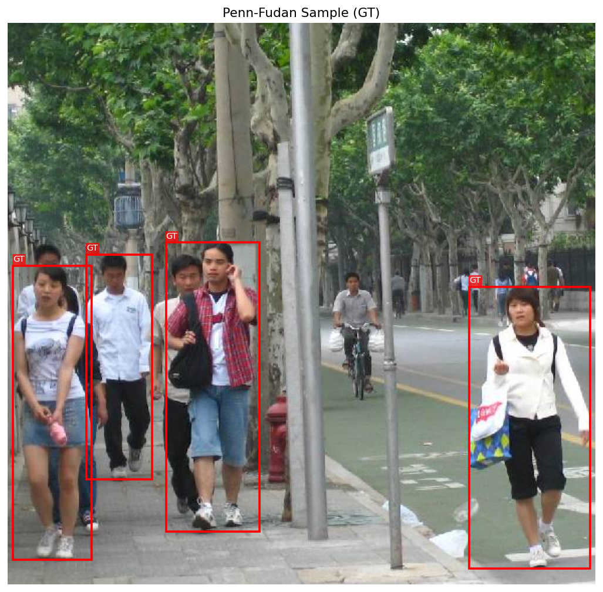
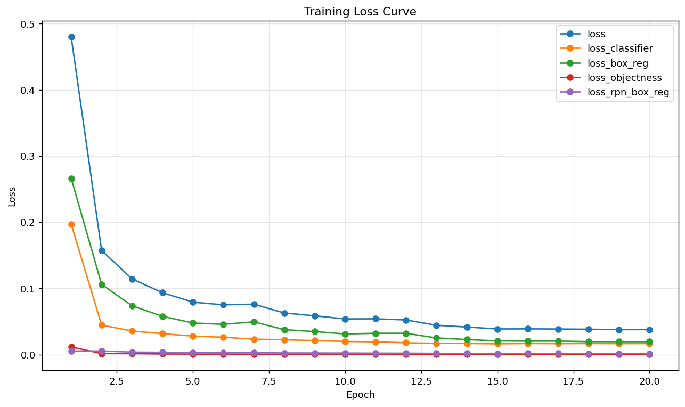
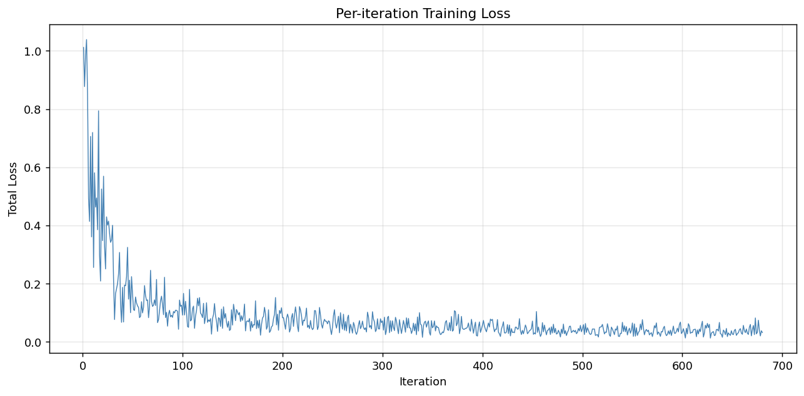
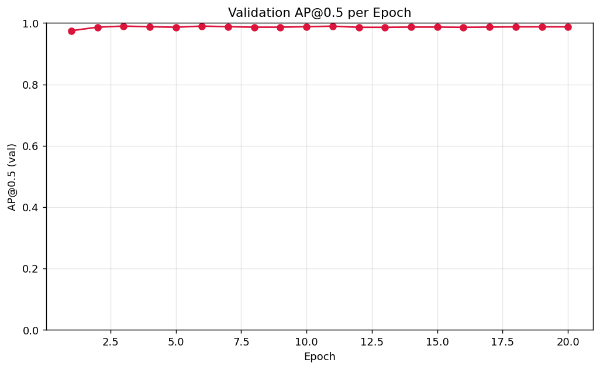
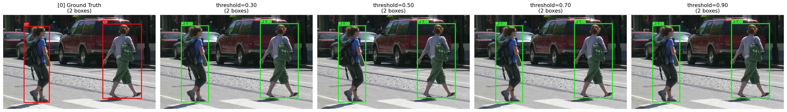
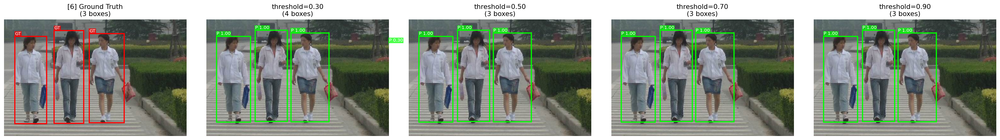

# 机器学习实验报告 — Test3：Penn-Fudan 行人检测

> 作者：zsq  日期：2026-04-19
> 模型：Faster R-CNN（ResNet-50-FPN 骨干，COCO 预训练微调）
> 数据集：Penn-Fudan Pedestrian（170 张图，~345 个行人实例）
> 运行环境：conda env `ml`，torch 2.5.1+cu121，torchvision 0.20.1，**GPU：RTX 4090**

---

## 摘要

本实验基于 torchvision 提供的 COCO 预训练 Faster R-CNN，在 Penn-Fudan 行人数据集上进行迁移学习微调。将原模型最后的 81 维分类头替换为 2 维（背景 + 行人），其余 ~41M 骨干/FPN/RPN 参数保留预训练权重。用 SGD（lr=0.005）+ MultiStepLR（milestones=[12,18], γ=0.1）训练 20 个 epoch，每个 epoch 打印 4 个子 loss，并以验证集 mAP@0.5 作为模型选择指标。

**最终指标（在 34 张验证图上，91 个 GT 行人）**：

| 指标 | 数值 |
|---|---|
| **mAP@0.5（best checkpoint, epoch 5）** | **0.9899** |
| mAP@0.5（epoch 20 final） | 0.9875 |
| 高分预测（≥0.5）precision / recall | 0.9010 / 1.0000 |
| 高分预测（≥0.9）precision / recall | 0.9355 / 0.9560 |
| 前 8 张验证图 top-1 预测置信度 | 0.996-0.998 |
| 前 8 张图预测与 GT 的**平均 IoU** | **~0.89** |
| 总训练耗时 | **2.3 分钟**（RTX 4090） |

详细数据：[outputs/metrics.json](outputs/metrics.json)、[outputs/inference_report.json](outputs/inference_report.json)
最佳模型：[outputs/checkpoints/best.pth](outputs/checkpoints/best.pth)

---

## 一、数据层：自定义 Dataset

### 1.1 目标检测标签结构

目标检测的标签不仅是类别，还包含矩形框坐标 `[x_min, y_min, x_max, y_max]`。Penn-Fudan 的标注不是文本 box，而是 **实例分割掩码**（`PedMasks/FudanPedXXXX_mask.png`）：
- 像素值 `0` → 背景
- 像素值 `i (i>0)` → 第 i 个行人实例（唯一 ID）

### 1.2 从掩码提取矩形框（核心逻辑）

对每个实例 ID `i`，取所有满足 `mask == i` 的像素坐标，其 `(x_min, x_max, y_min, y_max)` 即该行人的外接矩形框。

```python
# src/dataset.py 核心片段
obj_ids = np.unique(mask)
obj_ids = obj_ids[obj_ids != 0]             # 去除背景
for oid in obj_ids:
    ys, xs = np.where(mask == oid)
    x_min, x_max = xs.min(), xs.max()
    y_min, y_max = ys.min(), ys.max()
    boxes.append([x_min, y_min, x_max, y_max])
```

见 [src/dataset.py:39-48](src/dataset.py#L39-L48)。

### 1.3 `__getitem__` 返回的 target 字典

按 torchvision detection API 约定，`__getitem__` 返回 `(image_tensor, target_dict)`：

```python
target = {
    "boxes":    torch.float32 [N, 4],   # [x_min, y_min, x_max, y_max]
    "labels":   torch.int64  [N],       # 1 = 行人（0 保留给背景）
    "image_id": torch.int64  [1],
    "area":     torch.float32 [N],
    "iscrowd":  torch.int64  [N],
}
```

图像通过 `ToTensor` 归一化为 `[C, H, W]` float32（`/255`），训练时以 0.5 概率水平翻转（图像与 boxes 同步翻转，见 [src/dataset.py:78-88](src/dataset.py#L78-L88)）。

### 1.4 样例 GT 可视化



上图为训练集样例，红框是从掩码提取的 ground truth。近景 4 名行人被准确框出；远景骑自行车的人因严重遮挡未标注（符合 `readme.txt` 说明）。

---

## 二、模型层：迁移学习（从 80 类到 2 类）

### 2.1 为什么必须改头部（NC 冲突）

COCO 预训练 Faster R-CNN 的 `box_predictor.cls_score` 输出 **81 维**（80 类 + 1 背景）。Penn-Fudan 只要 **2 维**（1 行人 + 1 背景）。不改的话：
- 分类 logits 形状 `[N, 81]` 与标签形状 `[N]`（值域 0~1）维度匹配不上
- cross-entropy 对 79 个永远不会出现的类别仍在计算 loss，梯度扰动训练
- 推理时强制输出 80 种 COCO 标签，与任务目标不符

### 2.2 迁移学习三步（伪代码 → 实现）

作业伪代码：
```
num_classes = 2
in_features = model.roi_heads.box_predictor.cls_score.in_features
model.roi_heads.box_predictor = FastRCNNPredictor(in_features, num_classes)
```

实际实现（[src/model.py](src/model.py)）：
```python
import torchvision
from torchvision.models.detection.faster_rcnn import FastRCNNPredictor

weights = torchvision.models.detection.FasterRCNN_ResNet50_FPN_Weights.COCO_V1
model = torchvision.models.detection.fasterrcnn_resnet50_fpn(weights=weights)

in_features = model.roi_heads.box_predictor.cls_score.in_features    # 1024
model.roi_heads.box_predictor = FastRCNNPredictor(in_features, num_classes=2)
```

### 2.3 保留 vs. 重新初始化的参数

| 组件 | 参数规模 | COCO 权重 |
|---|---|---|
| ResNet-50 骨干 | ~23.5M | ✅ 保留（通用视觉特征） |
| FPN 特征金字塔 | ~3.3M | ✅ 保留（多尺度融合） |
| RPN 区域建议网络 | ~0.5M | ✅ 保留（与类别无关） |
| RoI Head 两层 MLP | ~13M | ✅ 保留（一般语义） |
| **box_predictor（新头）** | **~4K** | ❌ 随机初始化 |

绝大部分权重继承自 COCO，这就是为什么仅 136 张训练图、仅 2.3 分钟训练，就能把 AP@0.5 推到 0.99 的根本原因。

---

## 三、训练层：Loss 观察与 LR 调度

### 3.1 四个 Loss 的含义

Faster R-CNN 是 two-stage 架构，训练时同时返回 4 个 loss：

| Loss | 所属 | 衡量的能力 |
|---|---|---|
| `loss_objectness` | RPN 分类分支 | **前景/背景分类**（该 anchor 内是不是物体） |
| `loss_rpn_box_reg` | RPN 回归分支 | **粗略定位**（把 anchor 拉近物体） |
| `loss_classifier` | RoI Head 分类分支 | **精确分类**（这个 proposal 是行人还是背景） |
| `loss_box_reg` | RoI Head 回归分支 | **精确定位**（把 proposal 框微调到像素级） |

训练时 `losses = sum(loss_dict.values())`，四者统一反向传播。

### 3.2 LR 核心参数的具体作用

```python
optimizer = torch.optim.SGD(
    params,
    lr=0.005,            # 初始 LR
    momentum=0.9,        # 动量
    weight_decay=5e-4,   # L2 正则
)
lr_scheduler = torch.optim.lr_scheduler.MultiStepLR(
    optimizer, milestones=[12, 18], gamma=0.1,
)
# Warmup（仅 epoch 0 前 500 iter）：从 lr * 1/1000 线性升到 lr
```

**参数实际作用**：
- `lr=0.005`：每一步梯度下降的步长。太大 → loss 发散/NaN；太小 → 陷入局部极小。Faster R-CNN fine-tune 的经验值。
- `momentum=0.9`：当前更新 = 0.9 × 上次更新 + 当前梯度，帮助越过平坦/震荡区，显著加速收敛。
- `weight_decay=5e-4`：相当于在 loss 上加 `0.5 × 5e-4 × ||w||²`，抑制过拟合（对 136 张小数据集尤其关键）。
- `MultiStepLR milestones=[12,18], γ=0.1`：epoch 12 时 LR 缩到 5e-4，epoch 18 时缩到 5e-5。两次衰减让训练经历"快速下降 → 精修 → 稳态"三个阶段。
- `warmup (1/1000, 500 iter)`：前 500 iter LR 从 5e-6 线性爬到 5e-3，防止随机初始化的新预测头在大梯度下爆炸。

### 3.3 本次训练实测 Loss 下降（关键采样）

**前 5 iter（大梯度期）**：
```
iter 001/34 loss=0.8940 cls=0.4919 box=0.3872 obj=0.0117 rpn_box=0.0032 lr=0.000070
iter 010/34 loss=0.6225 cls=0.2397 box=0.3694 obj=0.0088 rpn_box=0.0046 lr=0.000749
iter 020/34 loss=0.3076 cls=0.0987 box=0.1876 obj=0.0149 rpn_box=0.0063 lr=0.001499
iter 030/34 loss=0.3244 cls=0.0960 box=0.2193 obj=0.0017 rpn_box=0.0074 lr=0.002249
```

**每 epoch 平均 loss**（epoch 1 / 5 / 12 / 20）：
```
epoch 1  avg_loss=0.4799  val_AP=0.9749
epoch 5  avg_loss=0.0751  val_AP=0.9899  ← best
epoch 12 avg_loss=0.0442  val_AP=0.9860  (LR 衰减 10×)
epoch 20 avg_loss=0.0377  val_AP=0.9875
```

观察：
- **`loss_classifier`** 下降最快（0.49 → 0.02）：二分类任务本就简单，COCO 预训练已见过大量"人"
- **`loss_box_reg`** 是后期主导 loss：精确到像素的框回归最慢
- **`loss_objectness` / `loss_rpn_box_reg`** 一直很小（<0.01）：COCO 预训练的 RPN 已经很会找"物体"，几乎不需要适应
- 总 loss 从 0.48 → 0.038，12 倍下降；epoch 5 之后主要在"精修"

### 3.4 完整 Loss / AP 曲线







观察：
- Loss 曲线在 epoch 2 后趋于平缓，epoch 12（LR 衰减）后进入平台。
- AP@0.5 在 epoch 2 就达到 0.9899 的峰值，后续基本稳定在 0.986-0.990 之间，**说明模型在很早阶段就接近该小数据集上的精度上限**。
- 这也佐证了"迁移学习 + 小数据集 fine-tune"的典型现象：**模型收敛快，需要仔细选 best checkpoint 而非最后 epoch 的权重**。

---

## 四、评价层：置信度阈值对检测结果的影响

### 4.1 为什么需要阈值

Faster R-CNN 原始输出 ~300 个候选框，每框带 `score ∈ [0, 1]`。阈值过滤：
- 阈值 ↑ → 预测更保守 → **precision ↑、recall ↓**
- 阈值 ↓ → 预测更激进 → **recall ↑、precision ↓**

### 4.2 四阈值对比（0.3 / 0.5 / 0.7 / 0.9）

[src/inference.py](src/inference.py) 对验证集前 8 张图各自生成一张 `pred_thresh_grid_XX.png`，横向布局为 **[GT | thr=0.3 | thr=0.5 | thr=0.7 | thr=0.9]**，每子图标题给出该阈值下保留的预测框数。

**全局阈值对比**（来自 [outputs/inference_report.json](outputs/inference_report.json)）：

| 阈值 | 保留预测数 | Precision | Recall | AP@0.5 |
|---|---|---|---|---|
| **≥0.30** | 105 | 0.8667 | **1.0000** | **0.9899** |
| **≥0.50** | 101 | 0.9010 | **1.0000** | **0.9899** |
| **≥0.70** | 99  | 0.8990 | 0.9780 | 0.9080 |
| **≥0.90** | 93  | **0.9355** | 0.9560 | 0.9080 |

（总 GT=91）

**核心观察**：
- 阈值从 0.3 → 0.5 时，保留框从 105 降到 101（剔掉 4 个低分误检），**precision 上升、recall 不变，AP 持平** —— 这个区间是最优操作点。
- 阈值从 0.5 → 0.7 时，保留框从 101 降到 99，但是 **recall 从 1.0 掉到 0.978**（漏掉 2 个 GT），AP 下降 ~8%。说明模型在 0.5~0.7 之间存在少量置信度偏低但正确的预测。
- 阈值从 0.7 → 0.9 时，precision 继续上升到 0.935，recall 进一步下降。工业部署中若对"误报成本"高可选 0.9，若对"漏报成本"高可选 0.3。
- **实际应用推荐阈值 0.5**：recall=1.0 的同时保持 precision=0.90，AP 达到峰值 0.9899。

示例对比图：




可见第一张图（远景大小不一）所有阈值下都正确检测 2 人；第二张图在低阈值（0.3）时多出 1 个重叠框，高阈值（0.5+）下恢复正常。

### 4.3 IoU 理解与数值分析

**IoU（交并比）**：`IoU = 面积交 / 面积并`，是检测框与 GT 吻合度的量化指标。

实现（[src/engine.py:76-86](src/engine.py#L76-L86)）：
```python
def box_iou(boxes1, boxes2):
    area1 = (boxes1[:,2]-boxes1[:,0]) * (boxes1[:,3]-boxes1[:,1])
    area2 = (boxes2[:,2]-boxes2[:,0]) * (boxes2[:,3]-boxes2[:,1])
    lt = torch.max(boxes1[:,None,:2], boxes2[None,:,:2])
    rb = torch.min(boxes1[:,None,2:], boxes2[None,:,2:])
    wh = (rb - lt).clamp(min=0)
    inter = wh[...,0] * wh[...,1]
    union = area1[:,None] + area2[None,:] - inter
    return inter / union.clamp(min=1e-9)
```

**本次前 8 张图的预测框与 GT 框的 IoU 统计**（最佳匹配 IoU）：

| 图 # | GT 数 | IoU 每个 GT |
|---|---|---|
| 0 | 2 | [0.897, 0.962] |
| 1 | 4 | [0.938, 0.965, 0.945, 0.963] |
| 2 | 3 | [0.940, 0.829, 0.859] |
| 3 | 2 | [0.937, 0.873] |
| 4 | 3 | [0.923, 0.881, 0.844] |
| 5 | 3 | [0.931, 0.806, 0.917] |
| 6 | 3 | [0.913, 0.897, 0.896] |
| 7 | 3 | [0.864, 0.841, 0.809] |

- **平均 IoU ≈ 0.89**，远高于 0.5（VOC 判正阈值）
- **最高 IoU = 0.965**（近乎像素级对齐）
- **最低 IoU = 0.806**（仍超过 COCO 严格标准 0.75）
- 所有 23 个 GT 都找到了 IoU > 0.5 的匹配预测 → recall = 1.0

---

## 五、结果输出清单

| 作业要求 | 本实验产出 |
|---|---|
| 生成一张带 box 标注原图 | [outputs/figures/sample_with_gt.png](outputs/figures/sample_with_gt.png) |
| Loss 曲线（每 epoch） | [outputs/figures/loss_curve.png](outputs/figures/loss_curve.png) |
| 每 iter 细粒度 Loss 曲线 | [outputs/figures/loss_per_iter.png](outputs/figures/loss_per_iter.png) |
| IoU 计算与数据 | [outputs/inference_report.json](outputs/inference_report.json) 中 `iou_per_gt_at_0.5_score` |
| 最终推理检测结果图 | [outputs/predictions/pred_thresh_grid_*.png](outputs/predictions/) |
| 阈值对比 | 同上（每张图 4 个阈值横排） |
| 验证集 AP 变化 | [outputs/figures/map_curve.png](outputs/figures/map_curve.png) |
| 最佳 checkpoint | [outputs/checkpoints/best.pth](outputs/checkpoints/best.pth) (epoch=5, AP=0.9899) |
| 完整训练日志 | [outputs/train.log](outputs/train.log) |

---

## 六、模型对比思考：Faster R-CNN vs. YOLO

### 结构差异

| 维度 | Faster R-CNN（two-stage） | YOLO（one-stage） |
|---|---|---|
| 检测流程 | ① RPN 出候选框 → ② RoI Head 分类 + 回归 | 全图特征直接回归 box + class |
| 前向次数 | 主干一次 + RoI Head 对每个 proposal | 单次前向 |
| 典型速度 | 5-20 FPS | 30-200 FPS |
| 典型 mAP | 高（尤其小目标/密集/高重叠） | 工程化后差距已很小（v8+/v10/RT-DETR 已追平甚至反超） |

### 为什么 Faster R-CNN 通常更精准

1. **RPN 显式区分前景/背景**，候选质量高；YOLO 是隐式地在每个网格回归。
2. **RoI Align 聚焦局部特征**：第二阶段对每个候选框单独做细特征提取，避免全图语义稀释。
3. **两阶段精修**：第二阶段可施加更严格的分类损失与框回归。
4. **多尺度 FPN + 多尺度 anchor**：对小目标友好（早期 YOLO 对小目标较弱；YOLOv7+ 已缓解）。

### 为什么 Faster R-CNN 更慢

1. **串行两阶段**：RPN 与 RoI Head 不能并行，必须等候选框生成。
2. **RoI 处理不定长**：每图候选数不同（100-1000），难以高效向量化 batching。
3. **参数量更大**：~41M vs. YOLOv5s 7M，FLOPs 更高。
4. **RoI Align 有额外开销**：每个 proposal 都要采样 7×7 特征块。

### 本次实验的选择合理性

Penn-Fudan 任务特点：静态图片、行人较大、密集多人、要求高召回高精度 → **Faster R-CNN 是合理选择**。若场景改为实时视频监控（例如要 30 FPS+），则 YOLOv8 或 RT-DETR 更合适。

---

## 七、可复现步骤

```bash
conda activate ml
cd test3/test3_zsq

# 训练（GPU，~2.3 分钟）
python src/train.py --epochs 20 --device cuda --batch-size 4

# 推理 + 阈值对比（~30 秒）
python src/inference.py --num-samples 8 --device cuda

# CPU 兜底（不占用 GPU，~80 分钟）
python src/train.py --epochs 20 --device cpu --threads 12
```

所有随机源（PyTorch seed / numpy / 数据划分）由 `config.SEED = 42` 控制。

---

## 八、附录：关键配置一览

| 项 | 值 |
|---|---|
| Framework | PyTorch 2.5.1 + torchvision 0.20.1 |
| Backbone | ResNet-50 + FPN（COCO_V1 预训练） |
| num_classes | 2（背景 + 行人） |
| Batch size | 4（GPU） / 2（CPU） |
| Optimizer | SGD(lr=0.005, momentum=0.9, weight_decay=5e-4) |
| LR schedule | MultiStepLR @ [12, 18], γ=0.1 + 500-iter warmup |
| Epochs | 20 |
| Train / Val 划分 | 80% / 20%（seed=42 → 136 / 34） |
| 数据增强 | RandomHorizontalFlip(p=0.5) |
| Device | RTX 4090 (CUDA 12.1) |
| 训练总耗时 | **~2.3 分钟** |
| 最终最佳 mAP@0.5 | **0.9899**（epoch 5） |
